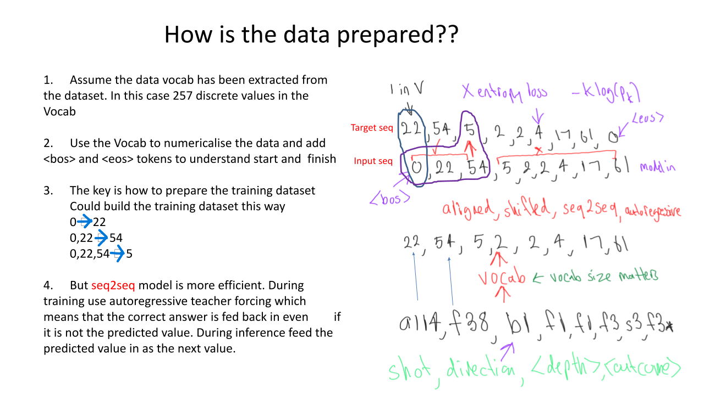

 
## Generative Models with an Application for Professional Tennis Data

Full credit for the data from the incedible resource 

[JeffSackman](https://github.com/JeffSackmann/tennis_MatchChartingProject)

What are Generative Models?

* Generative Models are models that generate synthetic probable realisations

* The models to do so are still essentially Machine Learning models except the target variable is interpreted as a parameter of a probability distribution and can therefore be sampled for realisations.

* For discrete distributions such as language commonly p(t;**θ**) = Cat(**θ**)

* E[**θ**]= f(**x**;**ω**) via a particular ML model and then sample from p()

Good to remember we are sampling from probability distributions even though the applications are incredibly good and look like magic!

* The challenging part isn’t really to generate the realisation, as much fun as it is, but to find a good use case for doing so. 

Generative Models are not new, consider say option pricing.

However things are more difficult with discrete sequential data
For large discrete distributions such as Natural Text, where the distribution is now categorical over the size of the token Vocab (1000’s), then this becomes
more difficult. As if things weren’t hard enough, if the data is sequential such that values are dependent upon the previous values, hence non IID or autoregressive, then this
becomes much, much more difficult unless you make assumptions such as

p(y |**y** ) = p(y |y ,y … y ) = p(y |y ,y ) - trigrams -> limited context

However what about autoregressive sequential data that has some similarities with language?

* Music notation is an example that is structured like language

* The current note is not independent of the previous notes

* I am not musical but I like sports so I was interested in understanding it’s sequential structure

* Hence many NLP techniques and architectures can be applied, although not usually pretrained models which are specific to language

* Shots within a tennis point as like words in a sentence. Professional Tennis players are like chess players – setting up strategies many shots ahead.
Unlike us their play is not random – Rafa Nadal a great example of this.

* It ties into a core concept in Machine Learning – observable vs latent. What we see during a sporting event looks quite unstructured however it is more likely to be a noisy representation of some much simpler latent behaviour.  Can we discover that latent behaviour with a language model?

* Code structure
To run

1. Clone the repo or download the files
2. use conda to setup an environment with the requirements.txt file
3. activate the new environment
4. chdir to the root directory of makemore_tennis_clean.py
5. run python makemore_tennis_clean.py

What does the code do?

1\. Generate new points data with and without prompts. This is the impressive part – think of ChatGPT. Prompting is the upside of this sequential sturcture

2\. To extract point embeddings – like document embeddings so we can cluster and extract similar points by semantic search. It may
ultimately help us uncover latent strategies The Generation part is what is getting all of the attention now,
particularly with the emergent capabilities of these Super Large
Language Models – simply doing things no one really expected.
However long term the ability of these models to uncover latent
structure via the embeddings may prove just as useful.

Going to need Data and lots of it!!

* Unfortunately the Hawkeye Data is not publicly available - yet

* However an amazing project at github.com/JeffSackman runs a match charting project

* Each point is coded as a sequence of shots

\- shot type,direction,<depth>,<outcome>

\- 1 f/h side, 2 middle, 3 b/h side

\- f1 -> forehand hit to forehand side

\- b3\* -> backhand cross court winner

* A point is a series of shots, with a beginning (serves a?? and an ending ??\*/@/#

a214,b28,f1\*

a116,b29,f1,f1,b2,b2n@
    
for a more detailed description of each point see

[Point Definitions])https://github.com/JeffSackmann/tennis_MatchChartingProject/blob/master/MatchChart%200.3.2.xlsm)

* The important point is that there is some sequential structure over a series of shots

How is the data prepared??
    

Transformer Architecture
    

 

Lets see how it works

* All code is in Python/Pytorch but there are many ways to do it –
Keras, Tensorflow, Hugginface, FASTAI, OPENAI etc depending
upon whether you want to work with low level code or a higher
level API. The code is adapted from nanoGPT
https://github.com/karpathy/nanoGPT
* Run python tennis_gpt.py -h to access help
* To train ** python tennis_gpt.py -i tennis_shots_new_all_final_reduced.txt -o tennis_gpt --type transformer --max-steps 10000 **
* To sample from a trained model ** python makemore_tennis_clean.py -i tennis_shots_new_all_final_reduced.txt -it <initial_token list e.g. a114,f39> -o tennis_gpt --type transformer --sample-only **

