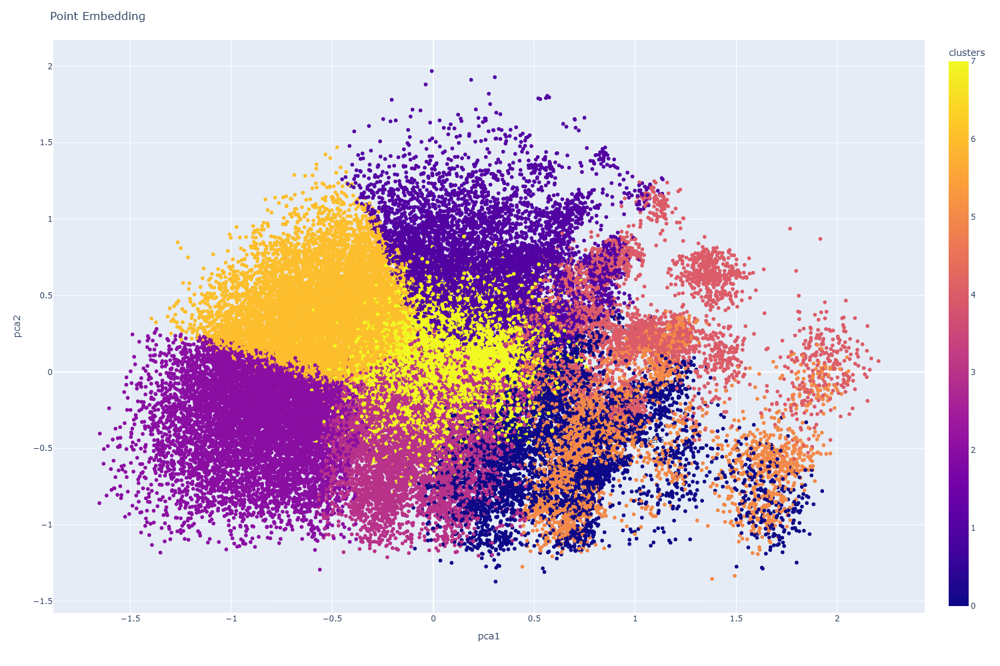

# 🎾 Generative Models for Professional Tennis Points


# 🎾 Unlocking tennis strategy with generative models — pretrained and fine-tuned

<div align="center">

🏸 Data → 🤖 Model → 🎯 Predicted Shot  
*From data to prediction: modeling tennis points with generative AI.*

</div>

---

## 🚀 Project Overview

This project **reimagines** professional tennis point data through the lens of **language modeling**.\
Whilst to the observer tennis points may look like a random selection of shots, infact professional players usually play against each other with specific strategies trying to out-think each other.
By treating sequences of tennis shots within points as individual tokens, similar to words/tokens within sentences, we unlock the power of **autoregressive models** to reveal hidden patterns in play, generate new points and playing styles and extract strategic embeddings.

Supported model architectures implented as *decoder-only* architectures include:  
- **Transformer** (implemented **from scratch** modified from [nanoGPT](https://github.com/karpathy/nanoGPT))  
- **LSTM** (Long Short-Term Memory)  
- **GRU** (Gated Recurrent Units)  
- **RNN** (Recurrent Neural Networks)  
- Variations of **Multilayer Perceptrons (MLPs)**

> 🚀 **Innovation**  
> This project shows how modern **generative models** can move beyond text data to model real-world sequential data from other sources such as sports, opening up new frontiers in **sports analytics**, **strategy**, and **simulation**.  
> 
> In addition to pretraining, the framework supports **domain-adaptive fine-tuning**: after training on general match data, models can be fine-tuned on specific players (e.g., **Roger Federer**) and styles based upon smaller style/player-specific datasets, enabling specialization in individual styles and decision-making.  
> This mirrors how state-of-the-art **language models** adapt to niche domains — but here, it's applied to the dynamic world of tennis, demonstrating the versatility of the modern LLM paradigm over model **training**, **adaptation**, and **deployment** in diverse fields.

---

## 📚 Data and Its Availability

The key ofcourse to pursuing this idea is shot sequence data to train the autoregressive decoer-only models\
*Going to need Data and lots of it!!*
**Hawkeye data** would be great for this but unfortunately, **Hawkeye data** is not publicly available — *yet*.

However, there is a fantastic open-source project by [Jeff Sackman](https://github.com/JeffSackmann) that provides a **match charting project** which can be leveraged for this work.

### Match Charting Data Overview:
- **Each point is encoded as a sequence of shots**, with the following attributes:
  - **Shot Type, Direction, Depth, Outcome**
    - **Shot types**: Forehand, Backhand, etc.
    - **Directions**: Forehand side (1), Middle (2), Backhand side (3)
  - Example encodings:
    - `f1` → Forehand hit to forehand side
    - `b3*` → Backhand cross-court winner

  A point is essentially a series of shots, starting with the serve and ending with a point conclusion:
  
  - Example Point 1: `a214,b28,f1*`
  - Example Point 2: `a116,b29,f1,f1,b2,b2n@`
  
  **Key Symbols:**
  - `@` and `#` represent point-ending symbols.
  - `*` denotes a winner shot.
  
For a more detailed description of each point, visit the official [Point Definitions](https://github.com/JeffSackmann/tennis_MatchChartingProject/blob/master/MatchChart%200.3.2.xlsm).

---

### Key Insight:
- This project made available a large dataset that exhibits **sequential structure** across a series of shots, making it ideal for training autoregressive models.

How is the data prepared??
    


---

## 🏗️ Features

- **Train generative models** on a large dataset of tennis shot sequences. This gives the model the general capability to understand shot selection within a point.
- **Fine tune generative models** on tennis shot sequences for specific players. This gives the model the capability to adapt to specific players or styles.
- **Sample** new realistic tennis points — with or without initial prompts (think ChatGPT for tennis rallies). The prompt can be the initial shot types within a point.
- **Generate shot embeddings** for visualization and clustering.
- **Extract full point embeddings** for downstream semantic search and analysis. Similar point strategies can be understood and extracted.

---

## ⚙️ How to Setup

Follow the steps below to set up the environment and run the code:

1. **Clone the repository:**   
   git clone https://github.com/GavinDowdell/generative_tennis.git
   

2. **Navigate into the project directory:** \
   cd generative_tennis
   

3. **Create a virtual environment:** \
   python -m venv tennis_env


4. **Activate the virtual environment:** \
   On **Windows**:
     .\tennis_env\Scripts\activate \
   On **Mac/Linux**:
     source tennis_env/bin/activate
     
5. **Install the required dependencies:** \
   pip install --upgrade pip
   pip install -r requirements.txt


6. **Run the code:**

   After setting up the environment, you're ready to run the project!

---

## Project Directory Structure

Here’s a quick overview of the project structure:

```
generative_tennis/
├── README.md                      # Project overview and setup instructions
├── requirements.txt               # List of dependencies for pip
├── tennis_gpt.py                  # Main training script
├── tennis_shot_data.txt           # Training dataset
├── tennis_shot_data_fine_tune.txt # An example of a Fine Tuning dataset
├── tennis_shot_data_unique.txt    # The dataset used to extract the point embeddings
├── plot_the_embedding_prodn.py    # Utility for visualizing embeddings
├── tennis_env/                    # (Optional) Local virtual environment (not tracked)
└── tennis_gpt/                    # Directory for model outputs
    └── model_type/                # Model checkpoints and logs
```


---

## ⚙️ How to Use the code

First, install dependencies:

```bash
pip install -r requirements.txt
```

### View available options:

```bash
python tennis_gpt.py -h
```

### Train a model:

```bash
python tennis_gpt.py -i tennis_shot_data.txt -o tennis_gpt\transformer --type transformer --max-steps 10000
```

- `--type` selects model architecture from **mlpmine1|mlpmine3|rnn|gru|lstm|transformer** for different modelling options
- `--max-steps` controls training duration.
- This code also plots the individual shot embeddings as well
- It is informative to compare the loss values, train and test loss curves and the quality of the generated points for various architectures.
- The transformer architecture, as shown below is state of the art, however it may not be the best choice for this data. There may or may not be long dependencies to capture.
  
    


### Fine Tune a pretrained model:
- fine tuning on a different dataset
```bash
python tennis_gpt.py -i tennis_shot_data_fine_tune.txt -o tennis_gpt\transformer  --max-steps 10000  --device cpu --type transformer --fine_tuning
```
- set the fine tuning flag with `--fine_tuning` flag
- The -o directory is the location of the original pretrained model. The fine tuned model and evaluation results will be stored in a sub-directory under this called finetune.
- `--type` selects model architecture from **mlpmine1|mlpmine3|rnn|gru|lstm|transformer** for different modelling options
- `--max-steps` controls training duration.
- The dataset for finetuning is the fine tuning dataset which is trying to align the model to this custom behaviour
### Sample from a trained model:
- The  sampling can be done of a trained model or a fine-tuned model
```bash
python tennis_gpt.py -i tennis_shot_data.txt -o tennis_gpt\transformer --type transformer --sample-only --initial-token a116,b38
```
- Set the '--sample-only' flag
- The `-it` option provides an **initial prompt** (shot/token list) to begin the point with a specific shot sequence. Supplying an initial shot sequence is optional
- The `--type` must match the model type that developed the model saved in -o working_directory

### Generate point embeddings:

```bash
python embedding_representations.py path/to/model_weights_file
```

The goal here is to use a trained transformer model to extract point embeddings – like document embeddings so we can cluster and extract similar points by semantic search. **It may
ultimately help us uncover latent strategies.** 

- Note this only works for the transformer models which will give the interesting contextual point embeddings
- An example of a point embedding plot is shown below


---

## ✨ Why This Matters

The **generation** of new points — especially with prompts — highlights the surprising ability of models to learn and **create realistic tactical sequences**.\
This mirrors the emergent behavior seen in large language models like ChatGPT.

In the long term, the ability to extract **meaningful embeddings** could uncover **latent strategic structures** within professional tennis points — helping players, coaches, and analysts understand the hidden patterns behind winning strategies.

---

## 🚤 Future Directions

- Add more detailed point metadata (e.g., court position, player info)
- Explore fine-tuning on specific player styles
- Extend to match-level modeling
- Incorporate reward-based objectives (e.g., winning point prediction)

---

## 📜 License and Data Source Attribution

The shot-by-shot professional tennis data used in this project is sourced from a public community dataset and is licensed under the [Creative Commons Attribution-NonCommercial-ShareAlike 4.0 International License (CC BY-NC-SA 4.0)](https://creativecommons.org/licenses/by-nc-sa/4.0/).\
Attribution to the original data contributors is acknowledged with thanks to the incredible resource maintained by Jeff Sackmann.\
See below for details.\
[JeffSackmann Match Charting Project](https://github.com/JeffSackmann/tennis_MatchChartingProject)\
This project is for research and educational purposes only.

## 📚 Data Source

The shot-by-shot professional tennis data used in this project is sourced from [tennis_MatchChartingProject](https://github.com/JeffSackmann/tennis_MatchChartingProject) maintained by Jeff Sackmann, and is licensed under the [Creative Commons Attribution-NonCommercial-ShareAlike 4.0 International License (CC BY-NC-SA 4.0)](https://creativecommons.org/licenses/by-nc-sa/4.0/).

---
## ✍️ Author

Gavin Dowdell\
[GitHub](https://github.com/GavinDowdell) • [LinkedIn](https://www.linkedin.com/in/gavin-dowdell-142452246/)

---

